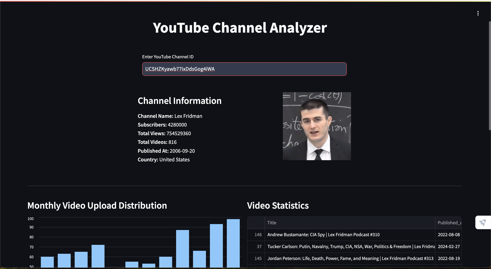
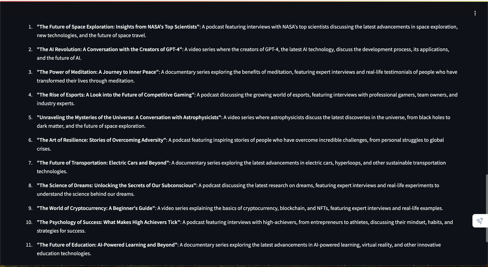
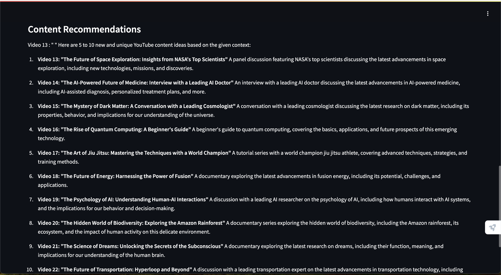
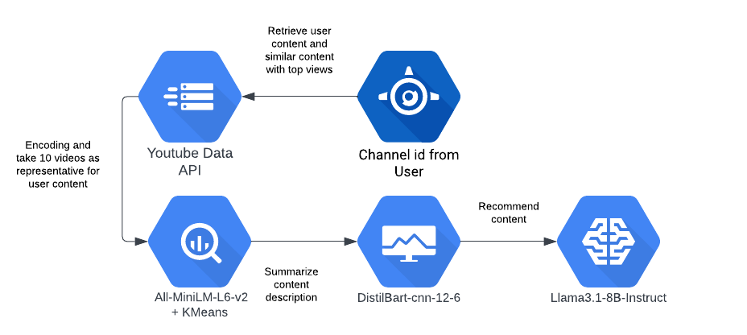

## YouTube Channel Analyzer
A powerful analytics and content recommendation tool that provides comprehensive insights into YouTube channels and generates AI-powered content recommendations using LLaMA 3.1.

## Features

1. Analytics Dashboard

**Video Statistics Overview**

- Total views, likes, and comments across all videos
- Average engagement metrics per video
- Growth trends over time


**Upload Pattern Analysis**

- Monthly upload distribution
- Daily upload frequency
- Day-of-week posting patterns
- Peak posting times visualization


**Performance Metrics**

- Video likes distribution
- View count distribution



2. AI-Powered Content Recommendations

**The recommendation pipeline leverages multiple models:**

1. Youtube API Integration: Analyzes current user content and retrieve top-performing similar videos based on category and tags.
2. Representative videos: All-MiniLM-L6-v2 generates content embeddings with K-Means clustering to obtain 10 representative videos (This is perform for computational efficiency).
3. DistilBart-CNN: Summarizes content descriptions
4. LLaMA 3.1: Provides contextual content recommendations





## Installation

1. Clone the repository:

```bash
git clone 
cd 
```
2. Install required packages:

```bash
pip install optimum auto-gptq einops google-api-python-client pycountry \
    scikit-learn langchain_core sentence_transformers bitsandbytes \
    transformers>=4.45.1 streamlit
```

3. Set up your YouTube API credentials and Hugginface api key:

- Go to Google Cloud Console
- Create a new project
- Enable YouTube Data API v3
- Create credentials (API key)

**Do the same api creation for HugginFace**

- Save your API key in .env file:

## Usage

1. Start the Streamlit application:

```bash
streamlit run app.py
```

2. Enter a YouTube channel ID in the interface
3. View analytics and recommendations in the dashboard

## Recommendation Pipeline Components

1. Channel Data Collection

- Fetches channel statistics and video data using YouTube API
- Fetches similar video based on user contents' tags and category

2. Data Processing

- Encodes video content using All-MiniLM-L6-v2
- Performs K-Means clustering for content grouping

3. Content Analysis

- Summarizes video descriptions using DistilBart-CNN

4. Recommendation Generation

- Uses LLaMA 3.1 to provide contextual content recommendations



## Further Improvement
- With more computational resources, more diverse video description could be input to the LLM
- Different information such as current trends, can be integrate to the system in order to allow the LLM to reason and recommend better.

